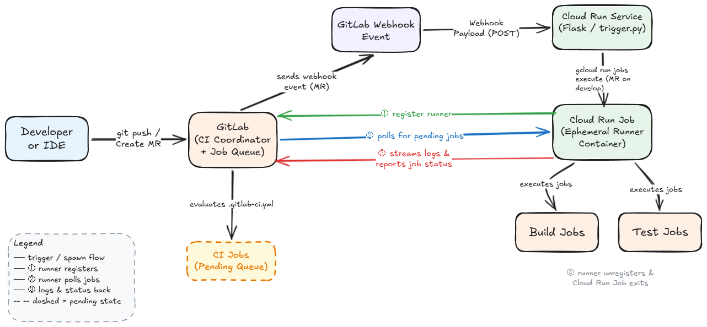

# CI/CD Architecture Documentation

## 1. Introduction
This document describes the CI/CD architecture implemented for the project and proposes an improved architecture using a Pub/Sub based event-driven runner scaling model.  
It covers the current architecture, workflow, improvements, security considerations, scalability strategies, and additional CI/CD enhancements such as linting, caching, and code quality analysis.

---

## 2. Current Architecture Overview
The current architecture uses GitLab pipelines with ephemeral runners deployed on Google Cloud Run.

When a pipeline event occurs, a webhook triggers a Cloud Run service that starts a Cloud Run job. The job dynamically registers a GitLab runner, processes CI jobs, and shuts down after completion.

---

## 3. Current Architecture Components

**Components**
1. GitLab Repository
2. GitLab CI Pipeline (`.gitlab-ci.yml`)
3. GitLab Webhook
4. Cloud Run Service (Flask trigger)
5. Cloud Run Job (Ephemeral GitLab Runner)
6. GitLab Runner Registration Script
7. CI Jobs (build/test)

**Key Files**
- `.gitlab-ci.yml` – Pipeline configuration
- `trigger.py` – Webhook endpoint
- `Dockerfile` – Cloud Run service container
- `entrypoint.sh` – Runner lifecycle script

---

## 4. Current Architecture Workflow

1. Developer pushes code or creates a merge request.
2. GitLab evaluates `.gitlab-ci.yml` and creates pipeline jobs.
3. Jobs remain in **pending** state waiting for a runner.
4. GitLab webhook triggers the Cloud Run Flask service.
5. Flask service executes a Cloud Run Job using `gcloud run jobs execute`.
6. Cloud Run job registers a temporary GitLab runner.
7. Runner picks pending CI jobs and executes them.
8. After job completion the runner unregisters itself.
9. Cloud Run job exits and infrastructure shuts down automatically.

---

## 5. Current Architecture Diagram

```
Developer Push
      |
      v
 GitLab Pipeline
      |
      v
 Pending Jobs
      |
      v
 GitLab Webhook
      |
      v
 Cloud Run Service (Flask Trigger)
      |
      v
 Cloud Run Job (Runner)
      |
      v
 Runner Registers → Executes Jobs → Unregisters
```

---

## 6. Advantages of Current Architecture

- Ephemeral runners reduce idle infrastructure cost.
- CI runners exist only during job execution.
- Easy to implement using webhook triggers.
- Works well for small teams and moderate CI workloads.

---

## 7. Limitations of Current Architecture

- Webhook triggers runner even if no jobs exist.
- No event buffering if webhook delivery fails.
- Limited scalability for large pipelines.
- Potential delay while runner registers and starts polling.
- No automatic parallel scaling of runners.

---

# Proposed Architecture (Pub/Sub Based)

## 8. Overview
The improved architecture introduces an event-driven layer using Google Cloud Pub/Sub.

Instead of directly triggering Cloud Run from GitLab webhooks, events are published to a Pub/Sub topic. A Cloud Run worker consumes these events and determines whether runners should be started.

---

## 9. Proposed Architecture Components

1. GitLab Webhook
2. Pub/Sub Topic
3. Cloud Run Worker (Event Processor)
4. GitLab API Job Status Checker
5. Cloud Run Job Runner Pool
6. Ephemeral GitLab Runners

---

## 10. Proposed Architecture Workflow

1. Merge request is created targeting `develop` branch.
2. GitLab triggers webhook.
3. Webhook publishes event to Pub/Sub topic.
4. Pub/Sub triggers Cloud Run worker.
5. Worker queries GitLab API for **pending jobs**.
6. If pending jobs exist, worker launches Cloud Run runner jobs.
7. Multiple runners may start in parallel.
8. Runners execute CI jobs.
9. Runners unregister and terminate.

---

## 11. Proposed Architecture Diagram

```
GitLab
   |
   v
Webhook
   |
   v
Pub/Sub Topic
   |
   v
Cloud Run Worker
   |
   v
Check Pending Jobs
   |
   v
Launch Multiple Cloud Run Runner Jobs
   |
   v
Execute CI Jobs in Parallel
```

---

## 12. Advantages of Proposed Architecture

- Event buffering prevents lost webhook events.
- Runners start only when pending jobs exist.
- Supports automatic parallel scaling.
- Faster CI job start time.
- Reduced infrastructure cost.
- Higher reliability for enterprise CI systems.

---

## 13. Drawbacks of Proposed Architecture

- Slightly more complex infrastructure.
- Requires Pub/Sub configuration.
- Additional monitoring may be required.
- Increased operational components.

---

# Additional CI/CD Improvements

## 14. Enhancements

### 1. Add Linter
- ESLint for frontend
- Checkstyle / Spotless for Java backend

### 2. Add SonarQube
- Code quality scanning
- Security vulnerability detection
- Maintainability metrics

### 3. Build Cache
- Cache Maven dependencies
- Cache Node modules
- Reduce pipeline build time

### 4. Convert Cloud Run Service to Cloud Function
- Replace Flask container with serverless function
- Faster cold start
- Simpler deployment

### 5. Increase Cloud Run Job Auto-scaling
- Allow multiple runner instances
- Enable parallel job execution

### 6. Check Pending Job Status
Before starting runners, call GitLab API:

```
GET /projects/:id/jobs?scope[]=pending
```

Start runners **only if pending jobs exist**.

### 7. Security Improvements
- Add webhook secret token validation
- Restrict service invocation using IAM
- Store tokens in Secret Manager

### 8. Convert Trigger to Pub/Sub
Instead of direct webhook execution:

```
Webhook → Pub/Sub → Cloud Run Worker → Runner Jobs
```

---

## 15. Security Recommendations

- Validate GitLab webhook secret token
- Use IAM roles for Cloud Run permissions
- Store GitLab tokens in Secret Manager
- Restrict Pub/Sub publisher permissions
- Enable audit logging for CI infrastructure

---

## 16. Conclusion

The current architecture provides an efficient ephemeral runner model that reduces idle infrastructure costs.

However, introducing a Pub/Sub based event-driven scaling architecture significantly improves:

- Scalability
- Reliability
- CI performance

Additional improvements such as caching, linting, code quality analysis, security enhancements, and runner auto-scaling create a production-ready CI/CD platform suitable for enterprise workloads.
